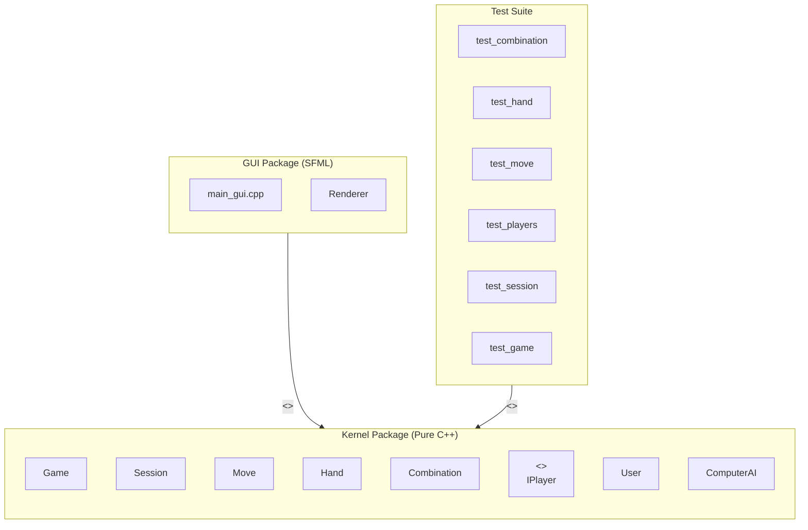
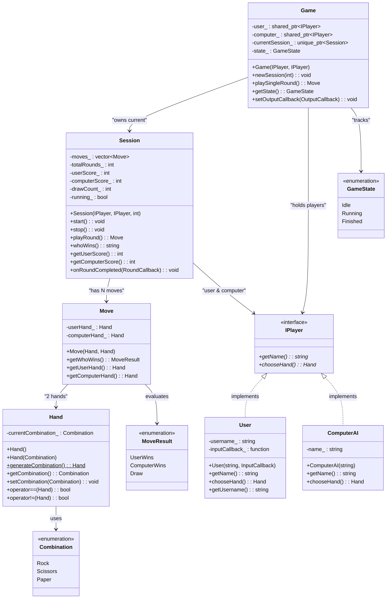
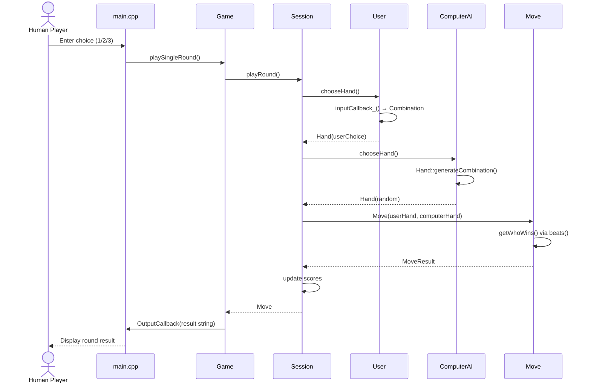
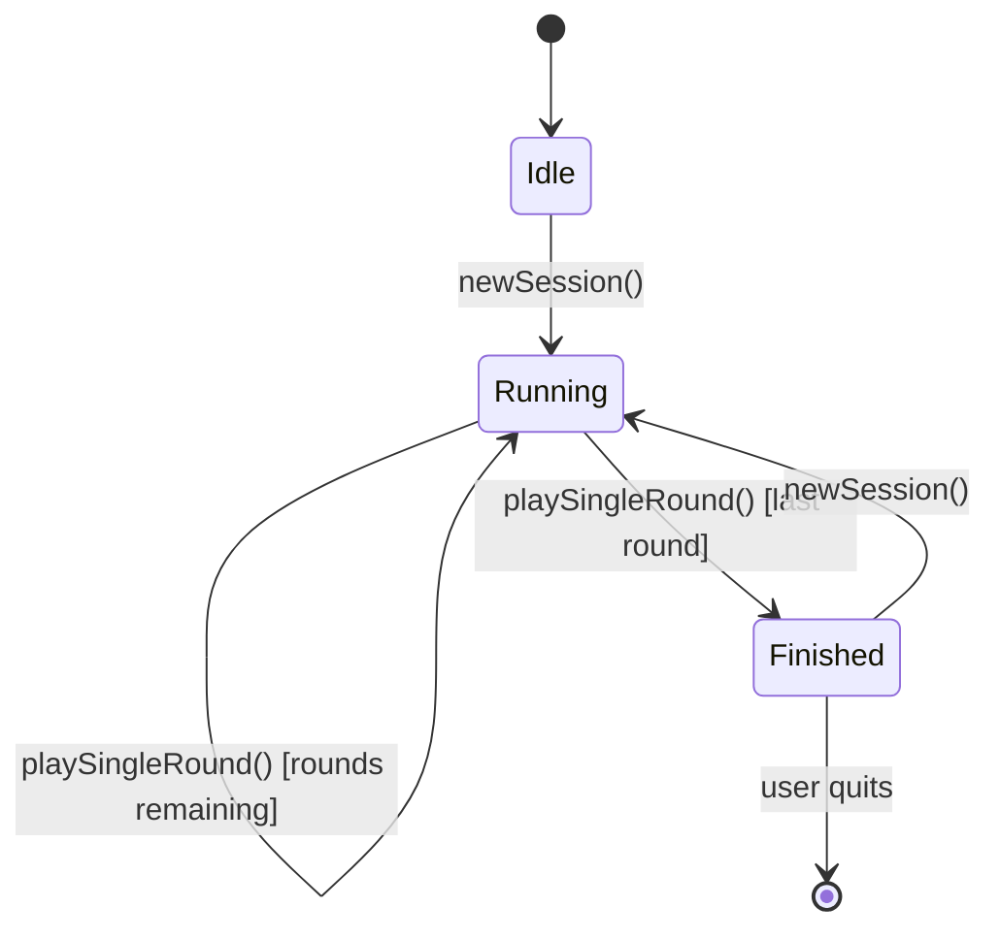
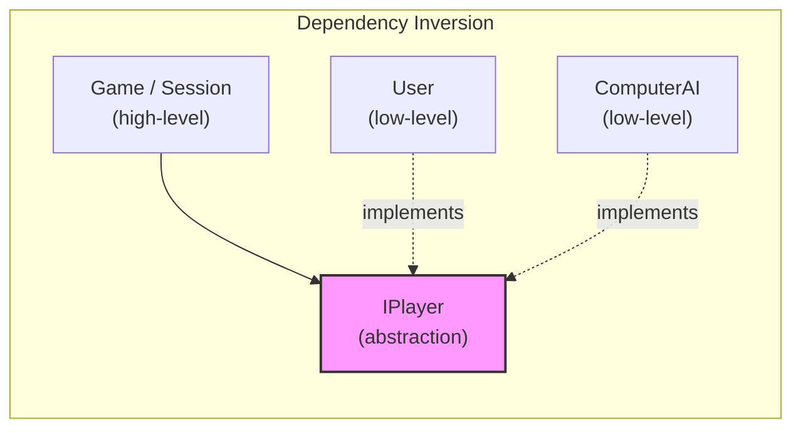
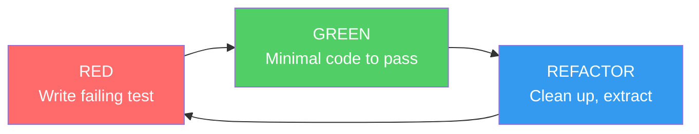
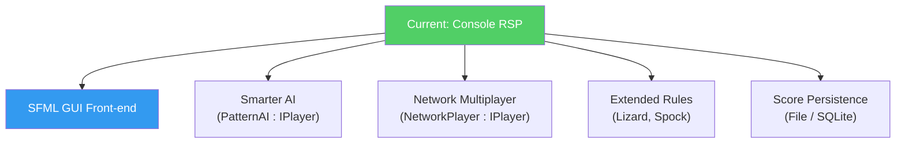

# Rock-Scissors-Paper Game — Implementation Report

## 1. Project Overview

| Attribute        | Value                                              |
|------------------|----------------------------------------------------|
| **Project**      | Rock-Scissors-Paper (RSP) — Educational C++ Game   |
| **Language**     | C++17                                              |
| **Build System** | CMake 3.16+                                        |
| **GUI Library**  | SFML 2.5+ (opt-in, under `C:/mingw64`)             |
| **Architecture** | Kernel (pure logic) + GUI (SFML front-end)         |
| **Tests**        | 48 unit tests — custom lightweight framework       |

---

## 2. Architecture & Package Diagram

The codebase follows a strict **two-layer architecture**: the **Kernel**
contains all game logic and is completely independent of any graphical
library; the **GUI** layer (to be implemented) depends on the Kernel.



---

## 3. Class Diagram



---

## 4. Sequence Diagram — Playing One Round



---

## 5. State Diagram — Game Lifecycle



---

## 6. File Structure

```
OneTwoGame_cpp/
├── CMakeLists.txt              # Build system (kernel + tests + optional GUI)
├── main.cpp                    # Console entry-point
├── REPORT.md                   # This report
│
├── src/
│   ├── kernel/                 # Pure game logic (no GUI dependencies)
│   │   ├── Combination.h       # Enum: Rock, Scissors, Paper + beats()
│   │   ├── Hand.h / .cpp       # Wraps a Combination, random generation
│   │   ├── IPlayer.h           # Abstract player interface
│   │   ├── User.h / .cpp       # Human player (input via callback)
│   │   ├── ComputerAI.h / .cpp # AI player (random strategy)
│   │   ├── Move.h / .cpp       # One round: 2 hands + result
│   │   ├── Session.h / .cpp    # N-round game session with scoring
│   │   └── Game.h / .cpp       # Top-level controller & state machine
│   │
│   ├── gui/                    # SFML front-end (to be implemented)
│   │   └── .gitkeep
│   └── assets/                 # Sprites, fonts, etc.
│       └── .gitkeep
│
├── tests/
│   ├── TestFramework.h         # Minimal single-header test framework
│   ├── test_main.cpp           # Test runner entry-point
│   ├── test_combination.cpp    # 12 tests for Combination enum
│   ├── test_hand.cpp           # 6 tests for Hand class
│   ├── test_move.cpp           # 8 tests for Move class
│   ├── test_players.cpp        # 7 tests for User & ComputerAI
│   ├── test_session.cpp        # 9 tests for Session class
│   └── test_game.cpp           # 6 tests for Game class
│
└── designDocs/
    ├── spec.md                 # Original specification
    └── RockSesorPaperGame.svg  # UML class diagram
```

---

## 7. Class Definitions Summary

| Class / Enum    | Responsibility                                         | Header                  |
|-----------------|--------------------------------------------------------|-------------------------|
| `Combination`   | Value object — Rock, Scissors, Paper                   | `Combination.h`         |
| `Hand`          | Wraps one Combination; can generate randomly           | `Hand.h`                |
| `IPlayer`       | Abstract interface for any participant                 | `IPlayer.h`             |
| `User`          | Human player; obtains input via injected callback      | `User.h`                |
| `ComputerAI`    | AI player; generates random hands                      | `ComputerAI.h`          |
| `MoveResult`    | Enum — UserWins, ComputerWins, Draw                    | `Move.h`                |
| `Move`          | One round — two Hands + outcome evaluation             | `Move.h`                |
| `Session`       | Orchestrates N rounds, keeps score, detects winner     | `Session.h`             |
| `GameState`     | Enum — Idle, Running, Finished                         | `Game.h`                |
| `Game`          | Top-level controller; lifecycle & output management    | `Game.h`                |

---

## 8. Design Patterns Applied

```mermaid
mindmap
  root((Design<br/>Patterns))
    Creational
      Factory Method
        Session creates Move objects
        Hand::generateCombination static factory
    Structural
      Facade
        Game class is the single entry-point for consumers
        Session hides the complexity of round management
    Behavioral
      Strategy
        IPlayer interface: User vs ComputerAI provide different hand-selection strategies
        User::InputCallback injectable input strategy
      Observer light
        Session::RoundCallback notifies external code after each round
        Game::OutputCallback pushes messages to any front-end
      Template Method light
        Session::playRound defines the skeleton: chooseHand → create Move → update score
      State light
        GameState enum: Idle → Running → Finished
      Information Expert
        Move knows how to evaluate its own outcome via beats()
```

| Pattern              | Where Applied                                               |
|----------------------|-------------------------------------------------------------|
| **Strategy**         | `IPlayer` interface — `User` and `ComputerAI` are interchangeable strategies for hand selection. `User::InputCallback` is a second-level strategy for I/O. |
| **Facade**           | `Game` exposes a simple API (`newSession`, `playSingleRound`) hiding the Session/Move/Hand internals. |
| **Factory Method**   | `Hand::generateCombination()` is a static factory. `Session` creates `Move` objects internally. |
| **Observer (light)** | `Session::onRoundCompleted()` and `Game::setOutputCallback()` decouple the Kernel from any display layer. |
| **Template Method**  | `Session::playRound()` defines the invariant round skeleton; the variable step is `IPlayer::chooseHand()`. |
| **State**            | `GameState` enum tracks the lifecycle; `Game` transitions between Idle → Running → Finished. |
| **Value Object**     | `Combination`, `Hand`, `Move` — compared by value, immutable after construction. |
| **Information Expert** | `Move::getWhoWins()` — the Move has both hands, so it's the expert on the outcome. |
| **Dependency Injection** | Players are injected into `Session` and `Game` as `shared_ptr<IPlayer>`. |

---

## 9. SOLID Principles Applied

| Principle | Application |
|-----------|-------------|
| **S — Single Responsibility** | Each class has one job: `Hand` holds a gesture, `Move` evaluates a round, `Session` manages scoring, `Game` manages lifecycle. |
| **O — Open/Closed** | New player types (e.g. `NetworkPlayer`, `ReplayPlayer`) can be added by implementing `IPlayer` — **no existing code needs to change**. The `Combination` enum is the only point that requires modification if new gestures are added (e.g. Lizard, Spock). |
| **L — Liskov Substitution** | `User` and `ComputerAI` are fully interchangeable wherever `IPlayer` is expected. Tests prove this — helper functions create deterministic "bot" players using the `User` class with a lambda, and the Session/Game logic works identically. |
| **I — Interface Segregation** | `IPlayer` exposes only `getName()` and `chooseHand()` — the bare minimum. `Session` does not expose internal scoring logic to players. The `RoundCallback` and `OutputCallback` are separate, optional interfaces. |
| **D — Dependency Inversion** | High-level modules (`Game`, `Session`) depend on the `IPlayer` abstraction, never on `User` or `ComputerAI` directly. I/O is injected via `std::function` callbacks, not hard-coded. |



---

## 10. Test-Driven Development (TDD) Approach

### Test Coverage Matrix

| Class / Module  | # Tests | What's Tested                                                     |
|-----------------|---------|-------------------------------------------------------------------|
| `Combination`   | 12      | All 9 beats() combinations (3 wins + 3 losses + 3 draws) + toString |
| `Hand`          | 6       | Default ctor, explicit ctor, setter, equality, random generation   |
| `Move`          | 8       | All 3 outcomes, hand accessors, result-to-string                   |
| `User`          | 4       | Name, callback delegation, dynamic return values                   |
| `ComputerAI`    | 3       | Default/custom name, valid random output                           |
| `Session`       | 9       | Round count, scoring, full session, single-round, callback, throws |
| `Game`          | 6       | State transitions, round play, output callback, error handling     |
| **Total**       | **48**  |                                                                    |

### TDD Red-Green-Refactor Cycle



**Key testing decisions:**
- **Deterministic players** — The `User` class accepts a `std::function<Combination()>` callback, making tests fully deterministic (no randomness, no I/O).
- **No external framework** — A custom 90-line `TestFramework.h` keeps the project self-contained for students. It supports `TEST_CASE`, `ASSERT_TRUE/FALSE/EQ/NE/THROWS`.
- **Boundary testing** — Tests verify that `Session::playRound()` throws `std::runtime_error` when all rounds are exhausted, and `Game::playSingleRound()` throws without an active session.

---

## 11. Build & Run Instructions

### Prerequisites
- **CMake** >= 3.16
- **MinGW** (GCC 6.3+ with C++17 support)
- **SFML** 2.5+ under `C:/mingw64` (only for GUI target)

### Console build (no SFML needed)

```bash
cmake -B build -G "MinGW Makefiles"
cmake --build build
```

### Run the game

```bash
./build/rsp_console.exe
```

### Run unit tests

```bash
./build/rsp_tests.exe
# or via CTest:
cd build && ctest --output-on-failure
```

### GUI build (when SFML is installed)

```bash
cmake -B build -G "MinGW Makefiles" -DBUILD_GUI=ON
cmake --build build
./build/rsp_gui.exe
```

---

## 12. Extensibility Roadmap



| Extension | Effort | SOLID Principle Leveraged |
|-----------|--------|--------------------------|
| SFML GUI | Medium | DIP — same Kernel, new front-end |
| Smarter AI | Low | OCP/LSP — new `IPlayer` implementation |
| Network play | Medium | Strategy — `NetworkPlayer : IPlayer` |
| Extended rules (Lizard/Spock) | Low | Modify `Combination` enum + `beats()` |
| Persistence | Low | Add a `ScoreRepository` behind an interface |

---

*Generated for the C++ OOP Workshop — Rock-Scissors-Paper Game*
